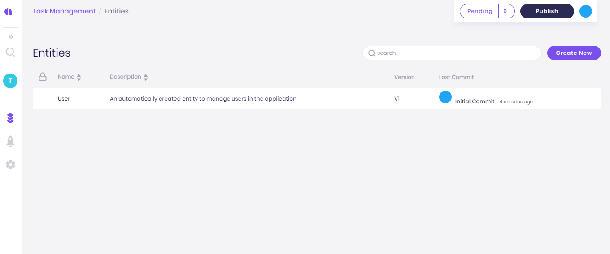
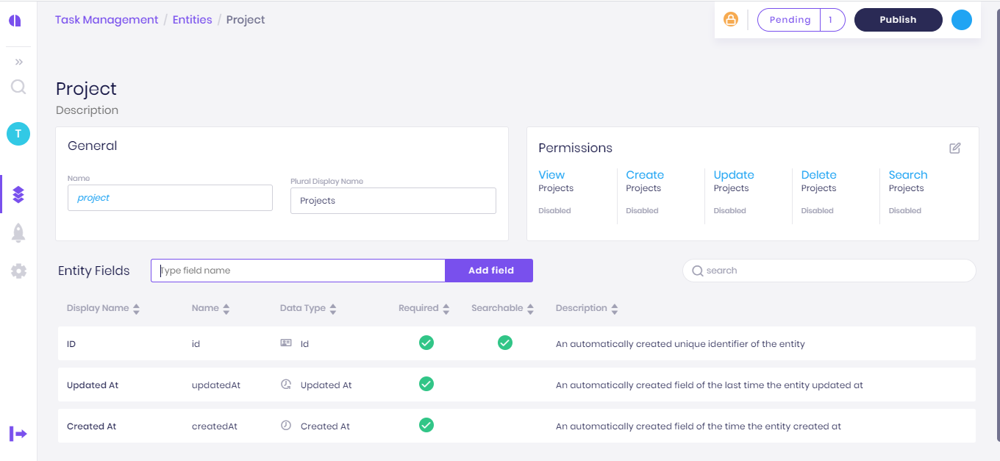

# Getting Started

Not sure how to get started? In this tutorial, you’ll learn how to create an application, how to add entities, how to add roles, and how to set permissions on entities.

Also, we will see how to commit changes and manage versions, and finally how to build your app and get it ready for deployment.

Let’s get started.

## Create a new app

Sign in to app.amplication.com. You should see the “My Apps” page. If not, click on the logo on the top left corner to navigate to this page.

In the “My Apps” page, click on “Create New App”

In the modal, give your app the name “Task Management” and a description “My first app for task management” and click on “Create App”.

## Create an Entity

On the left side of the screen, in the main menu, click on the “Entities” icon to navigate to the “Entities” page.

In the “Entities” page you see a list of all entities in your application. Currently, there is only a single “User” entity that was created by default with your new app.

Let’s create another entity called “Project”.

Click on “Create New” to open the “New Entity” modal.

Type in “Project” and click on “Create Entity”.

You now see the new “Project” entity. It already has some auto-generated values like “Plural Display Name” and some default fields – ID, Created At, and Updated At.

## Create Entity Fields

We now need to add some new fields to describe our projects. We will add the following fields:

* Name – to save the name of the project
* Description – to save a more detailed description of the project
* Start Date – to save the date in which this project starts.
* Owner – to assign a user to be an owner of the project.

### Create the Name field

To create the first field, type in “Name” in the textbox above the field list, and click on “Add Field” \(or just press Enter\).

The new field was created, and you see a panel with all the field properties.

On the field panel, click on the “required” toggle to make the “Name” field required.

### Create the Description Field

To create the next field, type in “Description” in the “New Field” textbox above the field list, and click on Enter.

Once again, you see the new field properties listed in the panel.

Change the data type of the new field from “Single Line Text” to “Multi-Line Text” to allow more space for the description.

### Create the Start Date Field

To create the next field, type in “Start Date” in the “New Field” textbox, and click on Enter.


Please note that you can use white spaces to better describe your fields. The value is saved as the field’s display name.

Also, each field has an auto-generated “name” which must not contain spaces or special characters. The name is later used for the API endpoint and in other places in the generated code.

If needed, you can manually set the field name.


Once again, you see the new field properties listed in the panel.

Change the data type of the new field from “Single Line Text” to “Date”.

### Create the Owner Field

To create the next field, type in “Owner” in the “New Field” text box, and click on Enter.

Change the data type of the new field from “Single Line Text” to “Relation to another entity”.

In the “Related Entity” select “User”.

Click on the “Required” toggle to make this field required.


Pro Tip:

You can create multiple fields, one after the other, by typing the display name of the field, press on “Enter”, and then start typing the display name of the next field. Continue this way with as many fields as you want.

After creating all fields, you can go back to each one of the fields and set its unique properties like data type, etc.


