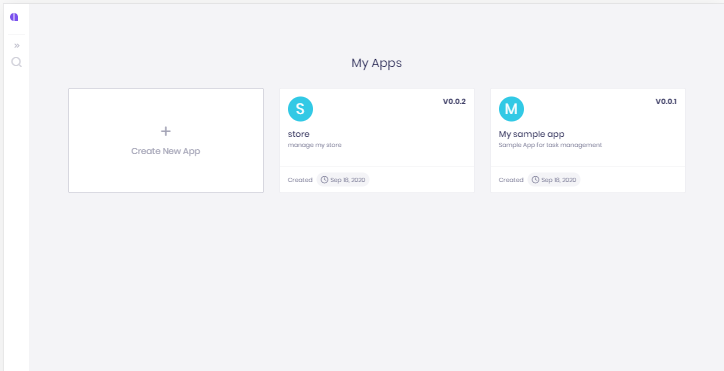

# Your first application

Not sure how to get started? In this tutorial, you’ll learn how to create an application, how to add entities, how to add roles, and how to set permissions on entities.

Also, we will see how to commit changes and manage versions, and finally how to build your app and get it ready for deployment.

Let’s get started.

## ✨ Create a new app

Sign in to [app.amplication.com](https://app.amplication.com). You should see the `My Apps` page. If not, click on the logo on the top left corner to navigate to this page.

In the `My Apps` page, click on **`Create New App`**

In the modal, give your app the name “Task Management” and a description “My first app for task management” and click on **`Create App`**.

## 🧙♂ Create an Entity

On the left side of the screen, in the main menu, click on the **`Entities`** icon to navigate to the `Entities` page.

In the `Entities` page you see a list of all entities in your application. Currently, there is only a single “User” entity that was created by default with your new app.

Let’s create another entity called “Project”.

Click on **`Create New`** to open the `New Entity` modal.

Type in “Project” and click on **`Create Entity`**.

You now see the new “Project” entity. It already has some auto-generated values like “Plural Display Name” and some default fields – ID, Created At, and Updated At.

## ✍ Add Entity Fields

We now need to add some new fields to describe our projects. We will add the following fields:

* Name – to save the name of the project
* Description – to save a more detailed description of the project
* Start Date – to save the date in which this project starts.
* Owner – to assign a user to be an owner of the project.

### Create the Name field

To create the first field, type in “Name” in the `New Field` textbox above the field list, and click on **`Add Field`** \(or just press Enter\).

The new field was created, and you see a panel with all the field properties.

In the field panel, click on the **`required`** toggle to make the “Name” field required.


🎈 **Note:** All changes are saved automatically


### Create the Description Field

To create the next field, type in “Description” in the `New Field` textbox above the field list, and click on Enter.

Once again, you see the new field properties listed in the panel.

Change the data type of the new field from `Single Line Text` to `Multi-Line Text` to allow more space for the description.

### Create the Start Date Field

To create the next field, type in “Start Date” in the `New Field` textbox, and click on Enter.


\*\*\*\*🎈 **Note:** Please note that you can use white spaces to better describe your fields. The value is saved as the field’s display name.

Also, each field has an auto-generated “name” which must not contain spaces or special characters. The name is later used for the API endpoint and in other places in the generated code.

If needed, you can manually set the field name.


Once again, you see the new field properties listed in the panel.

Change the data type of the new field from `Single Line Text` to `Date`.

### Create the Owner Field

To create the next field, type in “Owner” in the `New Field` text box, and click on Enter.

Change the data type of the new field from `Single Line Text`to `Relation to Another Entity`.

In the **`Related Entity`**select “User”.

Click on the **`Required`** toggle to make this field required.


🦸♂ **Pro Tip:**

You can create multiple fields, one after the other, by typing the display name of the field, press on “Enter”, and then start typing the display name of the next field. Continue this way with as many fields as you want.

After creating all fields, you can go back to each one of the fields and set its unique properties like data type, etc.


## 🔐 Set Access Permissions

In order to allow users to access the entity, we need to set the its permissions.

The permissions can be controlled separately for each of the following actions: 

* **View**
* **Create**
* **Update**
* **Delete**
* **Search**

By default, all the actions are **not permitted**, so we need to decide what actions we want to allow and to whom.

### Create Roles

Click on the **`settings`** icon in the main menu to navigate to the Roles list.

In the list, you should find one default role named "User". 

Let's create two new roles - Admin, and Manager.

In the `New Role` text box, type in "Admin" and click on **`Add Role`** or press Enter.

Do the same for the "Manager" role. 

###   Set Entity Permissions

Go back to the Entities list and navigate into the **Project** entity.

In the `Permissions` panel, click on the **`pencil`** icon to edit the permissions.

Initially we will allow all roles to perform all actions. So, for each of the actions listed in the panel, enable the toggle next to the action name.

Now, let's make sure that only users with the **Admin** role can delete projects. It takes two steps: 

1. Next to "Delete Projects" change the selection from `All Roles` to `Granular`.
2. Expand the role list, and select **Admin**.


\*\*\*\*🔆 **Note:** You can also set special permissions for specific fields. For example, you can prevent users from editing the Due Date of a project and allowing it only to managers. 

To do so, make sure to use `Granular` permissions, and click on **`+ Add Field`** below the role list. 

This option is not available for the **Delete** action


## 👌 Commit Your Changes

When working on Amplication your changes are saved automatically, but are not committed before you decide to do so. Only committed changes will be included in the next version of your application.

On the top right corner of the screen, you can always see how many pending changes are awaiting to be committed, in the `Pending` button.

Let's create our first commit to the changes done so far.

Click on the **`Pending`** button to navigate to the `Pending Changes` pages.

In the `Pending Changes` page, you can see that the creation of the **Project** entity is pending. 

Click on **`Commit Changes`**to open the `Commit Pending Changes` dialog.

Type in a short message to describe the changes, e.g. "Create Project Entity", and click on **`Commit`**.

All the changes are now committed. We can now build the first version of our app.

## 📦 Build a New Version

From the main menu, click on **`Publish`**. If you just committed your changes, you can also find the **`Publish`** button next to the success message.

On the left side of the screen, you can see a list of commits that were created in the app. This list will always show only the commits that were created since the last build. Since this is our first build, we see two commits. The first one was created automatically with your new application, and the second one we just created together.

 Click on **`Create Build`** to open the `New Build`dialog.

For our example, we will use the suggested build number "0.0.1". For the next builds, you will be able to control the version number by selecting whether to create a major version, a minor version, or a patch.

Type in a short message to describe the new build and click on **`Build New Version.`**

On the right side of the screen, you are now able to see a log of the build process. once it is completed. The new build is listed on the left side.

Click on **`Download`**to get a **.zip** file with the code of your new application. It is now ready to be deployed anywhere you want. 🚀 

## 💪🏾 Continue Building Your App

Now that we know how to create entities, commits changes, and build new versions, let's continue to build our app. In the next part of this guide, we will create another entity, and learn how to compare changes before committing.

## ✅ Create the Task Entity

Go back to `Entities` page, and click on **`Create New`** to open the `New Entity`modal.

Type in “Task” and click on **`Create Entity.`**

### Create Task Fields

Let's create the following fields for Task. For each line in the following table, create a new field, with the listed data type and properties.

<table>
  <thead>
    <tr>
      <th style="text-align:left">Field Name</th>
      <th style="text-align:left">Data Type</th>
      <th style="text-align:left">Properties</th>
    </tr>
  </thead>
  <tbody>
    <tr>
      <td style="text-align:left"><b>Title</b>
      </td>
      <td style="text-align:left">Single Line Text</td>
      <td style="text-align:left">Required</td>
    </tr>
    <tr>
      <td style="text-align:left"><b>Estimation (days)</b>
      </td>
      <td style="text-align:left">Whole Number</td>
      <td style="text-align:left"></td>
    </tr>
    <tr>
      <td style="text-align:left"><b>Start Date</b>
      </td>
      <td style="text-align:left">Date Time</td>
      <td style="text-align:left"></td>
    </tr>
    <tr>
      <td style="text-align:left"><b>Status</b>
      </td>
      <td style="text-align:left">Option Set</td>
      <td style="text-align:left">
        
Options:

        <ul>
          <li>New</li>
          <li>Pending</li>
          <li>On Hold</li>
          <li>Ongoing</li>
          <li>Done</li>
        </ul>
        
Required

      </td>
    </tr>
    <tr>
      <td style="text-align:left"><b>Project</b>
      </td>
      <td style="text-align:left">Relation to Another Entity</td>
      <td style="text-align:left">Related to: Project</td>
    </tr>
    <tr>
      <td style="text-align:left"><b>Assigned To</b>
      </td>
      <td style="text-align:left">Relation to Another Entity</td>
      <td style="text-align:left">Related to: User</td>
    </tr>
  </tbody>
</table>

The Task's field list should now look like this

## 🖊 Update the Project Entity

We now want to make some changes on the **Project** entity. Let's go back to the Entity list and click on the **Project** entity.

Add a new field called "Due Date" and select the **Date Time** as data type. 

Also, change the name of the "Owner" field to "Project Owner".

## 👭 Compare Pending Changes Before Commit

Click on the **`Pending`** button, which now shows indication for 2 changes.

In the `Pending Changes` page, we now see the two changes pending to be committed:

* The Task entity was created
* The Project entity was updated

Usually, before committing our changes it is a good practice to make sure all the changes were made intentionally. So, in order to see all the changes made to the Project entity, click on the `arrow` to expand the diff view.    

We can easily see that one new field was created, and the name of another field was changed.

Since we are happy with these changes, let's click on "Commit Changes".

**You are now ready to build a new version of your app. Great Work.**

