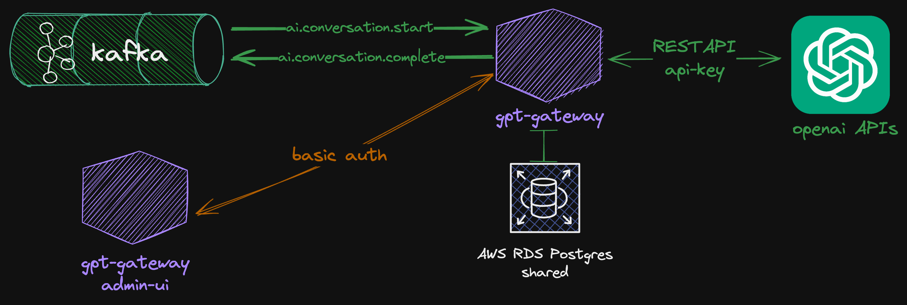
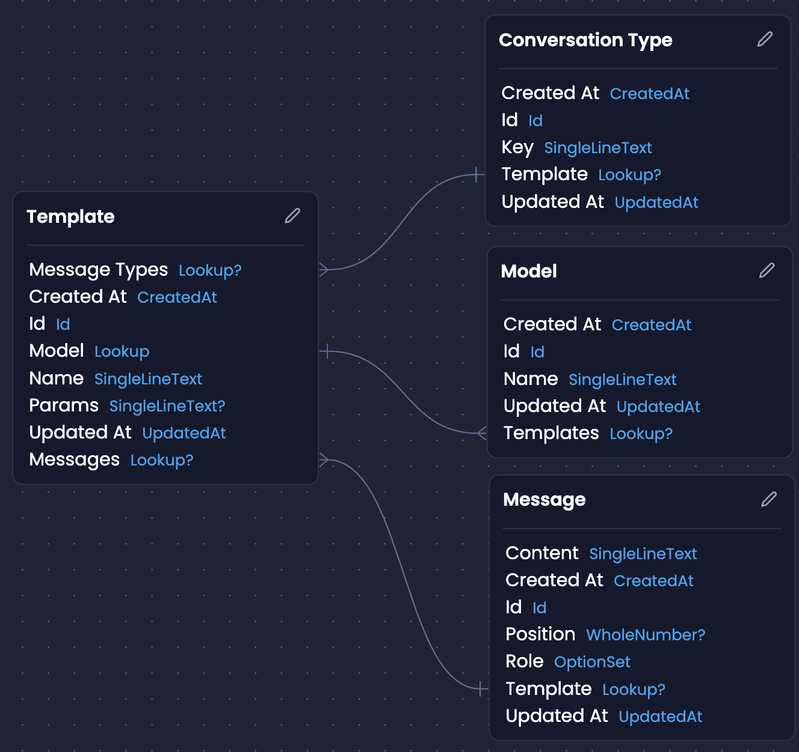

# Introduction

Service that act as a gateway to OpenAI API.



It allows to generate a message response from the only `conversationTypeKey` and `params` that will be interpolated in the messages part of the GPT conversation.
This is achieved by getting the template associated to the `conversationTypeKey` as it contains a list of messages, interpolating all the params and send them to the OpenAi APIs.



# Getting started

## Step 1: Configuration

Configuration for the server component can be provided through the use of environment variables. These can be passed to the application via the use of the `.env` file in the base directory of the generated service. Below a table can be found which show the different variables that can be passed - these are the variables which exist by default, through the use of plugins additional integrations could require additional values. These values are provided default values after generation, change them to the desired values.

| Variable             | Description                                  | Value                                                               |
| -------------------- | -------------------------------------------- | ------------------------------------------------------------------- |
| BCRYPT_SALT          | the string used for hashing                  | [random-string]                                                     |
| COMPOSE_PROJECT_NAME | the identifier of the service plus prefix    | amp_[service-identifier]                                            |
| PORT                 | the port on which to run the server          | 3000                                                                |
| DB_URL               | the connection url for the database          | [db-provider]://[username]:[password]@localhost:[db-port]/[db-name] |
| DB_PORT              | the port used by the database instance       | [db-provider-port]                                                  |
| DB_USER              | the username used to connect to the database | [username]                                                          |
| DB_PASSWORD          | the password used to connect to the database | [password]                                                          |
| DB_NAME              | the name of the database                     | [service-name] / [project-name]                                     |
| JWT_SECRET_KEY       | the secret used to sign the json-web token   | [secret]                                                            |
| JWT_EXPIRATION       | the expiration time for the json-web token   | 2d                                                                  |

> **Note**
> Amplication generates default values and stores them under the .env file. It is advised to use some form of secrets manager/vault solution when using in production. 

## Step 2.1: Scripts - pre-requisites

After configuration of the server the next step would be to run the application. Before running the server side of the component, make sure that the different pre-requisites are met - i.e., node.js [^16.x], npm, docker. After the setup of the pre-requisites the server component can be started.

```sh
# installation of the dependencies
$ npm install

# generate the prisma client
$ npm run prisma:generate
```

## Step 2.2: Scripts - local development

```sh
# start the database where the server component will connect to
$ npm run docker:dev

# initialize the database
$ npm run db:init

# start the server component
$ npm run start
```
By default, your app comes with one user with the username "admin" and password "admin".

## Step 2.2: Scripts - container based development

```shell
# start the server component as a docker container
$ npm run compose:up
```
