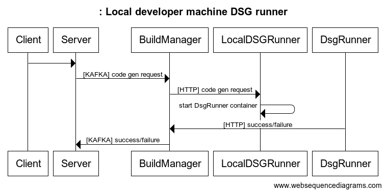

# Local Data Service Generator Controller

## <u>Overview</u>:
This service purpose is to run the Data Service Generator locally.
It exposes the following endpoint: 

`POST /api/code-generate`

The request body should be structured as follow:

```ts
buildId: string
resourceId: string
```

By this, it mimics the production workflow, but instead of using Argo, we call this endpoint exactly with the same request body as in production.

The following diagram explains the flow of this process:



When we run the local-data-service-generator-controller, it builds the image of `data-service-generator`. After having this image built, on each call to `/api/code-generate`, a new container named `dsg-controller-<buildId>` with this image is starting with the environment variables and the volume it needs.

After the container is finished to run, we would be able to see in the root Amplication repository `.amplication` (this folder is in `.gitignore`)folder with the build artifact and the dsg-jobs folders, each contains the generated code and the `input.json` file in the respective `buildId`

### <u>Development Environment</u>
As Amplication use microservices architecture, in order to see all this workflow works locally, you need to run the following services:

First, we need to run the container of Amplication

```
npm run docker:dev
```

amplication-client
```
npx nx serve amplication-client
```

amplication-server
```
npx nx serve amplication-server
```

amplication-build-manager
```
npx nx serve amplication-build-manager
```

local-data-service-generator-controller
```
npx nx serve local-data-service-generator-controller
```

#### Troubleshooting issues in DSG

By default, the `local-data-service-generator-controller` automatically clean up exited continers. If you need to read the logs of a failing job, change the .env `AUTOREMOVE_CONTAINER` environment variable to `false` and the container won't be removed from Docker Desktop (or Podman Desktop) 
